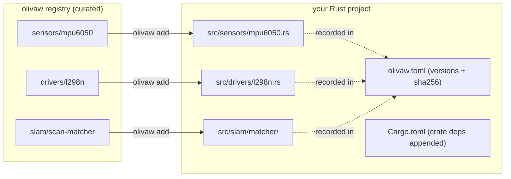

# 01 — Project overview

## What olivaw is

`olivaw` is a CLI that vendors robotics components — sensor drivers, motor
drivers, kinematics, SLAM building blocks — into a user's Rust project as
**source code they own**. It is the `shadcn/ui` model applied to embedded
robotics: every `olivaw add` copies real, working, tested files into the
project tree. It never adds a crate dependency, it is not a build system,
and it is not a code generator.

## Why vendoring instead of crates

The embedded Rust ecosystem's hardest practical problem is `embedded-hal`
version churn. A driver crate pinned to `embedded-hal 0.2` and an HAL on
`1.0` do not compose; the user is stuck waiting for a maintainer to publish
a release. Vendoring sidesteps the problem structurally:

- the component lands in the user's tree, compiled against *their* HAL
  version;
- if it needs a tweak — a different register default, an extra method —
  they just edit the file;
- the project's dependency graph stays exactly as small as the user wants.

The cost of vendoring is losing automatic updates, which is why `update`
exists and why it is built around drift detection rather than blind
overwriting (see [04](04-safety-and-drift-detection.md)).

## Command surface

The surface is deliberately small; every command is API that must be
supported forever.

| command | role |
| --- | --- |
| `olivaw init --target <esp32/rp2040/linux>` | Scaffold a project that builds and flashes immediately |
| `olivaw add <category>/<component>` | Vendor a component and its component dependencies |
| `olivaw list [<category>]` | Show the registry, marking installed components |
| `olivaw info <category>/<component>` | Metadata, wiring, Cargo additions, verification status |
| `olivaw update <category>/<component>` | Re-fetch with diff-first, never-clobber semantics |
| `olivaw check` | Verify installed files against recorded checksums (CI-friendly) |

Global flags: `--offline` (never touch the network) and
`--registry-tag <tag>` / `OLIVAW_REGISTRY_TAG` (pin a different registry
snapshot).

Deliberately excluded: `remove` (users delete files), `publish` (the
registry is curated via pull requests), `search` (`list` plus grep suffices
at this scale), and any hosted service.

## The two repos behind the components

| source | what came from it |
| --- | --- |
| [olivaw-lidar](https://github.com/Project-Olivaw/olivaw-lidar) | `sensors/rplidar` — the no-I/O protocol core, extracted verbatim |
| [olivaw-slam](https://github.com/Project-Olivaw/olivaw-slam) | `slam/core-types` and `slam/scan-matcher` — extracted with import rewrites |
| Hands-On-Robotics (C++ reference firmware) | `drivers/l298n`, `drivers/led`, `comms/cmdvel-protocol` — behaviour ports; the C++ was verified on an ESP32 DevKit v1 |
| datasheets | `sensors/mpu6050`, `sensors/hcsr04`, `kinematics/differential-drive` — written fresh |

Ports and fresh components carry `verified = false` in their
`component.toml` until they have been flashed on real hardware; `olivaw
info` and `olivaw add` surface that status honestly. See
[03](03-registry-and-components.md).
