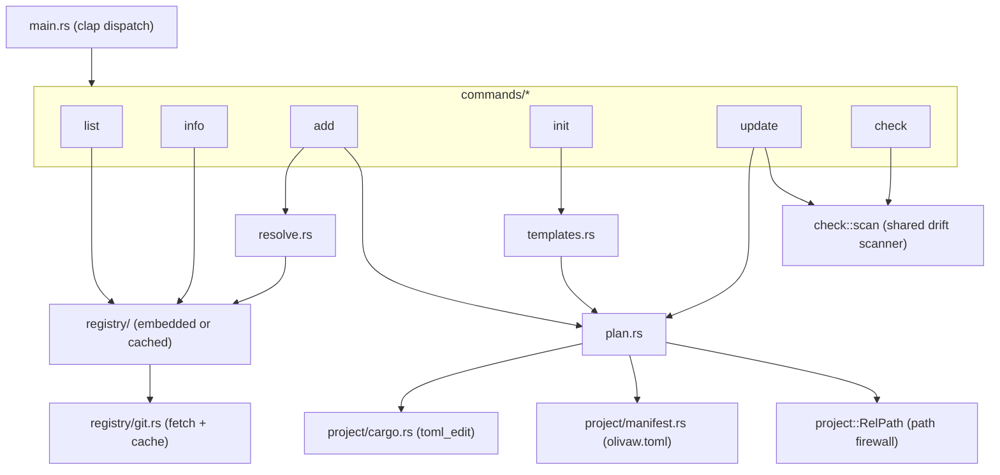

# 02 — Architecture

## Crate layout

One binary crate, no workspace. Two directories are compiled into the binary
with `include_dir!`: `registry/` (the components) and `templates/` (the init
scaffolds).

```text
src/
├── main.rs              clap derive CLI, dispatch, exit-code mapping
├── ui.rs                colour/TTY handling, spinner, unified diff rendering
├── suggest.rs           two-row Levenshtein + did-you-mean (no dependency)
├── checksum.rs          sha256 -> "sha256:<hex>" (stable format)
├── resolve.rs           DFS post-order component-dependency resolution
├── plan.rs              Plan { file_writes, cargo_deps, manifest_updates }
├── registry/
│   ├── mod.rs           Registry, RegistrySource, ComponentId, load policy
│   ├── index.rs         registry.toml schema (tiny, parsed by `list`)
│   ├── component.rs     component.toml schema (incl. [verification])
│   └── git.rs           tag-pinned clone into ~/.olivaw/cache, fallback
├── project/
│   ├── mod.rs           Project::discover, RelPath (path-safety type)
│   ├── manifest.rs      olivaw.toml read/write, per-file checksums
│   └── cargo.rs         toml_edit append-only edits to the user's Cargo.toml
├── templates.rs         Target enum, scaffold_plan() -> Plan
└── commands/            one file per subcommand
```

## Module relationships



## Key types

- **`ComponentId`** — validated `category/name` (lowercase, hyphenated, one
  slash). The only way component paths enter the system; parsing failures
  produce a message that shows the expected format.
- **`Registry`** — an index (`registry.toml`, parsed eagerly because it is
  tiny) plus a `RegistrySource` enum: `Embedded` (include_dir) or
  `Cached { root, tag }` (a git checkout). `component.toml` files are parsed
  lazily, one per lookup, which is what keeps `list`/`info` in single-digit
  milliseconds.
- **`RelPath`** — a project-relative path proven safe at construction:
  rejects absolute paths, `..`, `~`, and drive prefixes. `plan.rs` accepts
  destinations only as `RelPath`, so `component.toml` data (treated as
  hostile) cannot write outside the project. The single sanctioned write
  outside the project is the registry cache under `~/.olivaw/cache`.
- **`Plan`** — the shared install machinery. `add`, `init` and `update` all
  build a `Plan` (file writes + Cargo dependencies + manifest updates),
  present it, then execute it.
- **`ProjectManifest`** — `olivaw.toml`. Machine-owned (serde `toml` writer
  with a "Managed by olivaw" header); only the user's `Cargo.toml` gets the
  format-preserving `toml_edit` treatment.

## Anatomy of `olivaw add`

```mermaid
sequenceDiagram
    participant U as user
    participant A as add.rs
    participant R as Registry
    participant V as resolve.rs
    participant P as Plan
    participant FS as project tree

    U->>A: olivaw add slam/scan-matcher
    A->>A: Project::discover (refuse if no Cargo.toml)
    A->>R: load_fetching (cache -> fetch -> embedded fallback)
    A->>V: resolve([scan-matcher], installed)
    V->>R: component.toml lookups (recursive, cycle-checked)
    V-->>A: install order: [core-types, scan-matcher]
    A->>U: confirm extra components (dialoguer; non-TTY needs --force)
    A->>P: build Plan (RelPath-validated dests, sha256 per file)
    Note over A,P: existing dest without --force -> hard error listing conflicts
    P->>FS: 1. write component files (create parent dirs)
    P->>FS: 2. append missing deps to Cargo.toml (toml_edit)
    P->>FS: 3. save olivaw.toml last
    A->>U: report: files, "+ dep" lines, wiring notes, verification warning, Try it
```

Execution order inside `Plan::execute` is deliberate: component files first,
then `Cargo.toml`, then `olivaw.toml` **last** — the manifest only ever
describes files that actually exist on disk, so a crash mid-install cannot
record state that is not there.

## Exit codes

| code | meaning |
| --- | --- |
| 0 | success (including `check` with no drift) |
| 1 | runtime error, or `check` found drift |
| 2 | CLI usage error (clap) |

Errors print as a single anyhow context chain (`error: <ctx>: <cause>`) on
stderr, and every error message states what to do next — a did-you-mean
suggestion, the command to run, or the flag to add.

## Output and colour

`Ui` centralizes styling. Colour is enabled only when stdout is a TTY and
`NO_COLOR` is unset; every code path renders identical text without ANSI
codes otherwise. Prompts (`dialoguer`) only appear when stdin and stdout are
both TTYs; non-interactive runs get explicit refusals with the flag to use
instead. The spinner (`indicatif`) exists only during a git fetch and only
on a TTY.
