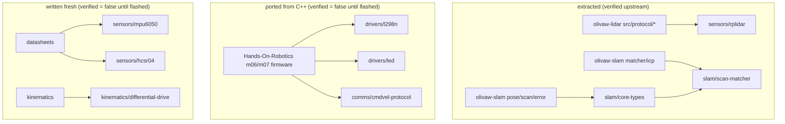

# 03 — Registry and components

## Layout

```text
registry/
├── registry.toml                     index: version + description per component
├── sensors/
│   ├── mpu6050/   {component.toml, src/mpu6050.rs, example.rs, README.md}
│   ├── hcsr04/    {component.toml, src/hcsr04.rs, example.rs, README.md}
│   └── rplidar/   {component.toml, src/{mod,command,descriptor,info,scan_node}.rs, example.rs, README.md}
├── drivers/
│   ├── l298n/     ...
│   └── led/       ...
├── kinematics/
│   └── differential-drive/ ...
├── comms/
│   └── cmdvel-protocol/ ...
└── slam/
    ├── core-types/   {pose,scan,error}.rs
    └── scan-matcher/ {mod,icp,test_scenes}.rs   (depends on slam/core-types)
```

`registry.toml` is the only file `list` parses — it stays tiny on purpose so
`list` stays fast as the registry grows. Each component's `component.toml`
is parsed lazily on lookup, and its `name`/`category` must match its
directory (checked at load; a mismatch is reported as a registry bug).

## component.toml schema

The schema follows CLAUDE.md with one addition, `[verification]`:

```toml
[component]        # name, category, version, description, license
[hardware]         # devices, interface, voltage, notes (notes become the "Wiring:" line)
[compatibility]    # no_std, embedded_hal version, targets
[verification]     # verified = true/false, reference = "provenance and board"
[[files]]          # src (in the component dir) -> dest (in the user project), optional flag
[dependencies.cargo]       # crates the user's Cargo.toml needs
[dependencies.components]  # other olivaw components, resolved recursively
```

`[verification]` exists because several components are Rust ports of C++
reference firmware that has been verified on hardware while the port itself
has not yet been flashed. Shipping them marked `verified = false` keeps the
registry honest: `olivaw info` prints the status and `olivaw add` warns.
Flip the flag (and update `reference` with the board) after a hardware pass.

## Quality bar

A component enters the registry only if all of these hold:

1. generic over `embedded-hal 1.0` traits, never concrete HAL types;
2. `no_std` where the domain allows (all sensors/drivers/comms/kinematics;
   the SLAM components declare `std`);
3. zero `unsafe`;
4. hardware verification status honestly declared (see above);
5. multi-file only when justified, flagged in review (rplidar and the slam
   pair exceed the roughly-300-line guideline deliberately);
6. every public item documented, units explicit (g, degrees/s, mm, metres,
   radians, per-mille);
7. a runnable example and a README with a wiring table;
8. no `unwrap()` in component code (tests may).

The `no_std` claims are not aspirational: the golden checks compile all
seven `no_std` components for `thumbv6m-none-eabi` (bare metal, no
allocator).

## How each component was produced



Extraction rules that were applied and should be reused:

- **Imports become relative.** `use crate::pose::...` in olivaw-slam became
  `use super::pose::...` (or `super::super::` from inside `matcher/`), so
  the vendored tree works wherever the user mounts it.
- **No error-macro dependencies.** `thiserror` derives were replaced with
  hand-written `Display`/`Error` impls. Reason: `dependencies.cargo` maps a
  crate name to a version string only — it cannot express
  `default-features = false`, and plain `thiserror = "2"` would drag `std`
  into `no_std` builds. Zero-dependency error types avoid the problem
  entirely.
- **No feature-gated attributes.** `#[cfg_attr(feature = "serialize", ...)]`
  lines were stripped; the user's crate does not have those features.
- **Test-only dependencies are rewritten away.** `approx` assertions became
  a local `assert_close` helper / macro so vendored tests run with no extra
  dev-dependencies.
- **Upstream tests travel with the code.** Vendored files keep their
  `#[cfg(test)]` modules; they run under the user's `cargo test`.

## Module wiring conventions

Vendored files must be reachable from the user's module tree. The rules:

- A component may vend a `mod.rs` only for a directory it owns entirely
  (`src/sensors/rplidar/mod.rs`, `src/slam/matcher/mod.rs`).
- Category-level aggregators (`src/sensors/mod.rs`, the `mod slam { ... }`
  block) are **user-owned** and never vendored. If two components both wrote
  `src/slam/mod.rs`, installing the second would either clobber the first or
  trip drift detection forever.
- Component READMEs state the exact one-line wiring
  (`mod drivers { pub mod l298n; }` in `main.rs`).

## Examples: host-runnable with inline mocks

Every example is a host program that includes the vendored source by path
and drives it through tiny inline mock implementations of the
`embedded-hal` traits:

```rust
#[allow(dead_code, unused_imports)]
#[path = "../src/drivers/l298n.rs"]
mod l298n;
```

This choice does three jobs at once: the example runs on any machine with
`cargo run --example ...` (no hardware, no target toolchain), it proves the
component really is generic over the traits (a mock is just another
implementation), and it works in binary-only projects where `examples/`
cannot import from the crate. Mocks share state with the test bench via
`Rc<Cell<...>>` so the example can observe pin levels the driver sets.

For multi-file components the example re-bases an inline module instead:

```rust
#[path = "../src/slam"]
mod slam {
    pub mod error;
    pub mod matcher;
    pub mod pose;
    pub mod scan;
}
```

See [08 — lessons learned](08-lessons-learned.md) for why it must be written
exactly this way.

## Adding a new component: checklist

1. Create `registry/<category>/<name>/` with `component.toml`, `src/...`,
   `example.rs`, `README.md` (wiring table, usage, troubleshooting).
2. Set `[verification]` honestly.
3. Add the entry to `registry/registry.toml`.
4. Run the scratch checks: `cargo test --test golden -- --ignored` (compiles
   every component vendored into a scaffold) and, for `no_std` claims,
   compile for `thumbv6m-none-eabi`.
5. `cargo test` — the snapshot tests will show the new `list` output for
   deliberate review (`cargo insta review` or `INSTA_UPDATE=always`).
