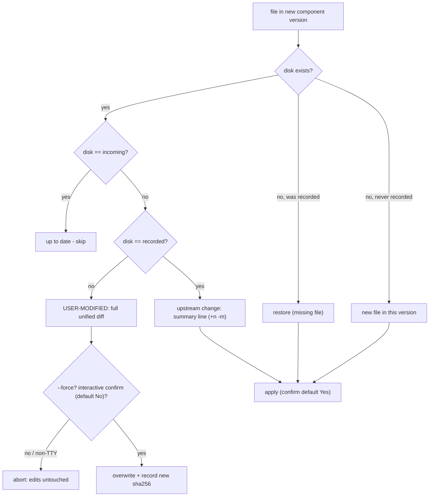

# 04 — Safety and drift detection

Silently destroying a user's edits is the one unforgivable bug in a
vendoring tool. Everything in this document exists to make that bug
structurally impossible.

## The recorded state: olivaw.toml

`add` records, per component: version, install timestamp (RFC 3339 UTC),
the list of installed files, and a **per-file** sha256 of the original
vendored content:

```toml
[components."drivers/l298n"]
version = "0.1.0"
installed_at = "2026-07-21T03:11:47Z"
files = ["src/drivers/l298n.rs", "examples/l298n_sweep.rs"]

[components."drivers/l298n".checksums]
"src/drivers/l298n.rs" = "sha256:f15a..."
"examples/l298n_sweep.rs" = "sha256:f06d..."
```

CLAUDE.md sketched a single checksum per component; per-file hashes are a
deliberate refinement — they are what allows `check` and `update` to report
*which* file drifted instead of "something changed".

The hash format `sha256:<lowercase hex>` is stable. Changing it invalidates
every recorded manifest in every user project; do not.

## The three-hash algorithm in `update`

For each file the new component version wants to write, three hashes are in
play: **recorded** (install time), **disk** (now), **incoming** (new
version).



Decision rules worth restating:

- A file with **no recorded checksum** is treated as user-modified. When in
  doubt, protect the local file.
- Files that were installed but are **dropped by the new version** are
  reported and left in place — the user owns their tree; olivaw never
  deletes.
- Non-interactive runs (CI, pipes) cannot confirm, so a pending
  user-modified overwrite **aborts** with instructions to re-run with
  `--force`. `--dry-run` prints the full plan and writes nothing.
- After a successful update the manifest records the **incoming** hashes, so
  the next drift scan has the correct baseline.

## `check`: the read-only scanner

`check` reuses the same comparison (recorded vs disk) without ever loading
incoming content. Per file it reports `ok`, `modified`, `missing`, or
`no recorded checksum`; it also verifies that every component-declared cargo
dependency is present in `Cargo.toml` and prints copy-pasteable fixes.

Exit codes are CI-friendly: 0 clean, 1 drift found, 2 could-not-run. With
`--quiet` a clean run prints nothing.

## Path safety: RelPath

`component.toml` destinations are data from the registry — treated as
hostile until proven safe. `RelPath::new` rejects, at construction:

- absolute paths (`/etc/passwd`);
- any `..` component (`src/../../evil.rs`);
- home references (`~/x`);
- Windows drive/UNC prefixes.

`plan.rs` accepts destinations only as `RelPath`, so nothing downstream can
write outside the project root. The `--path <dir>` prefix goes through the
same validation. The only sanctioned write outside the project is the
registry cache under `~/.olivaw/cache` (see
[05](05-distribution-and-git-registry.md)).

## Cargo.toml: append-only, format-preserving

The user's `Cargo.toml` is parsed with `toml_edit`, which preserves
formatting and comments. The rules in `project/cargo.rs`:

- a dependency that exists in any form (version string, inline table,
  `workspace = true`, dotted table) is **never touched**; a differing
  requirement is reported as a note, not changed;
- missing dependencies are appended to `[dependencies]`, creating the table
  at the end of the file only if absent;
- no sort or format API is ever called, and the file is written only when
  the rendered output actually differs;
- CRLF files stay CRLF (`toml_edit` normalizes to LF internally; the writer
  restores CRLF when the original used it consistently).

Unit fixtures assert byte-identical untouched regions for commented,
inline-table, workspace-dep and CRLF files.
