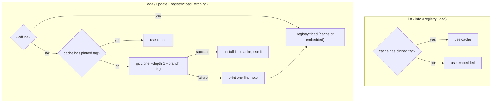

# 05 — Distribution and the git-backed registry

## Two-layer model

- **v0.1 — embedded.** The whole `registry/` directory is compiled into the
  binary with `include_dir!`. Zero network, works offline, instant,
  reproducible: a given CLI binary always contains a known registry
  snapshot.
- **v0.2 — git-backed with a local cache.** `add` and `update` additionally
  try to fetch the registry at a pinned git tag, cached under
  `~/.olivaw/cache/registry/<tag>/`. This lets components ship without a new
  CLI release. There is deliberately no hosted service — a git repo is the
  registry.

The registry lives inside this very repo (`registry/` directory); tags named
`registry-v<CLI version>` pin its content. Publishing new components to
existing CLI binaries is just pushing a tag.

## Load policy

`list` and `info` **never touch the network** — that is what makes their
sub-100 ms budget structural rather than lucky. Only `add` and `update` may
fetch.



The fallback is silent-by-default in outcome but never in reporting: a
failed fetch prints one line naming the reason before degrading to the
embedded registry, so users always know which snapshot served them.
`olivaw list` also prints the active source (`registry v0.1.0 (embedded)` or
`cache (registry-v0.1.0)`).

## Cache layout and crash safety

```text
~/.olivaw/cache/registry/
├── registry-v0.1.0/         immutable checkout at that tag (plain data, .git stripped)
├── registry-v0.2.0/
└── .tmp-registry-v0.2.0/    clone in progress; renamed into place on success
```

- A tag directory is valid iff it contains `registry.toml`. Tags are
  immutable, so a valid directory is never re-fetched — no TTL, no
  lockfile.
- Clones land in `.tmp-<tag>` and are renamed into place, so a crashed or
  interrupted fetch can never leave a half-valid cache; stale tmp
  directories are cleared on the next attempt.
- After the clone, the repo's `registry/` subdirectory is promoted to be the
  cache content and everything else (including `.git`) is dropped: the cache
  is plain data. A bare registry repo (with `registry.toml` at its root) is
  also accepted.

## Why shell out to `git` instead of linking git2/gix

The only operation ever needed is
`git clone --depth 1 --branch <tag> <url> <dir>`. Linking `git2` brings
libgit2 plus OpenSSL/ssh C dependencies; `gix` brings a very large crate
graph. Both blow up build times for a CLI whose spec explicitly values fast
builds. Every plausible user of an embedded-Rust vendoring tool has `git`
installed, and if it is missing or the network is down, the failure mode is
already designed: fall back to the embedded registry with a note.

## Overrides and the test seam

| knob | effect |
| --- | --- |
| `--offline` | never fetch; cache-or-embedded |
| `--registry-tag <tag>` / `OLIVAW_REGISTRY_TAG` | pin a different tag than `registry-v<version>` |
| `OLIVAW_REGISTRY_URL` | fetch from a different repo (also the integration-test seam) |

The integration tests build a local git repo with an extra component, tag it,
point `OLIVAW_REGISTRY_URL` at it, and then delete the "remote" to prove the
second run is served purely from the cache.

## Release flow for a registry update

1. Merge component changes into `main` (CI runs the golden checks).
2. Tag `registry-vX.Y.Z` and push the tag.
3. Existing CLI binaries whose pinned tag matches pick it up on their next
   `add`/`update`; older binaries keep working from their embedded snapshot.
