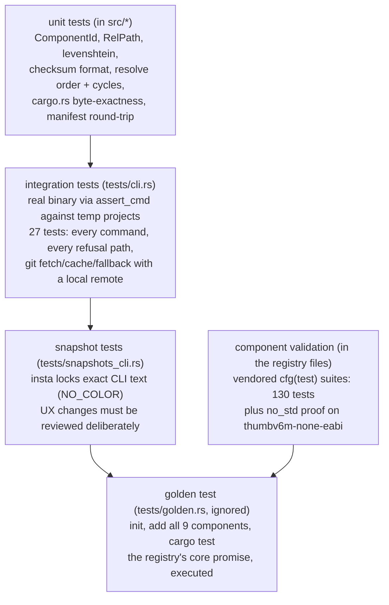

# 07 — Testing and CI

## The layers



- **Unit** tests live next to the code and cover the pure logic: id/path
  validation (including every traversal-escape case), dependency resolution
  order and cycle naming, the stable checksum format, and byte-exact
  `Cargo.toml` editing on hostile fixtures (comments, inline tables,
  `workspace = true`, CRLF).
- **Integration** tests run the real binary in a tempdir with an isolated
  `HOME` and `NO_COLOR=1`, and `--offline` everywhere except the git tests,
  which build a local "remote" repo, tag it, fetch through
  `OLIVAW_REGISTRY_URL`, then delete the remote to prove cache hits.
  The trust-critical paths all have a test: conflict refusal, the
  modified-file update refusal (edit must survive), `--dry-run` writing
  nothing, `check` exit codes.
- **Snapshots** (insta) freeze `list`, `info`, the did-you-mean error and
  `--help`. Snapshot churn in a PR is a prompt to look at the UX diff, which
  is the point.
- **Golden** is the one that matters most: scaffold a linux project, vendor
  every component through the real `add` (dependency resolution included),
  wire the module tree, and run `cargo test --all-targets` on the result.
  It is `#[ignore]`d locally (slow, hits crates.io) and explicit in CI.

## Running things

```bash
cargo test                              # unit + integration + snapshots
cargo test --test golden -- --ignored   # the full vendor-and-compile pass
cargo insta review                      # after deliberate UX changes
```

## CI jobs (.github/workflows/ci.yml)

| job | what it proves |
| --- | --- |
| `test` | fmt, clippy `-D warnings`, all fast tests |
| `golden-host` | every component vendors and compiles in a linux scaffold |
| `golden-rp2040` | the rp2040 scaffold builds for thumbv6m-none-eabi |
| `golden-esp32` | the esp32 scaffold builds under the Xtensa toolchain (espressif/idf-rust container) |

The golden jobs are the drift alarm for the registry: a component that
stops compiling against its declared `embedded-hal` version, or a scaffold
broken by a dependency release, fails CI before it reaches users.

## Conventions for new tests

- Never touch the real `~/.olivaw` — always point `HOME` at a tempdir.
- Always set `NO_COLOR=1` so assertions and snapshots are ANSI-free.
- Prefer asserting on user-visible text (the error message with its
  suggestion) over internal state; the UX is the product.
- A new component needs no new CLI tests, but its vendored `#[cfg(test)]`
  suite runs inside the golden test automatically — write the tests in the
  component.
