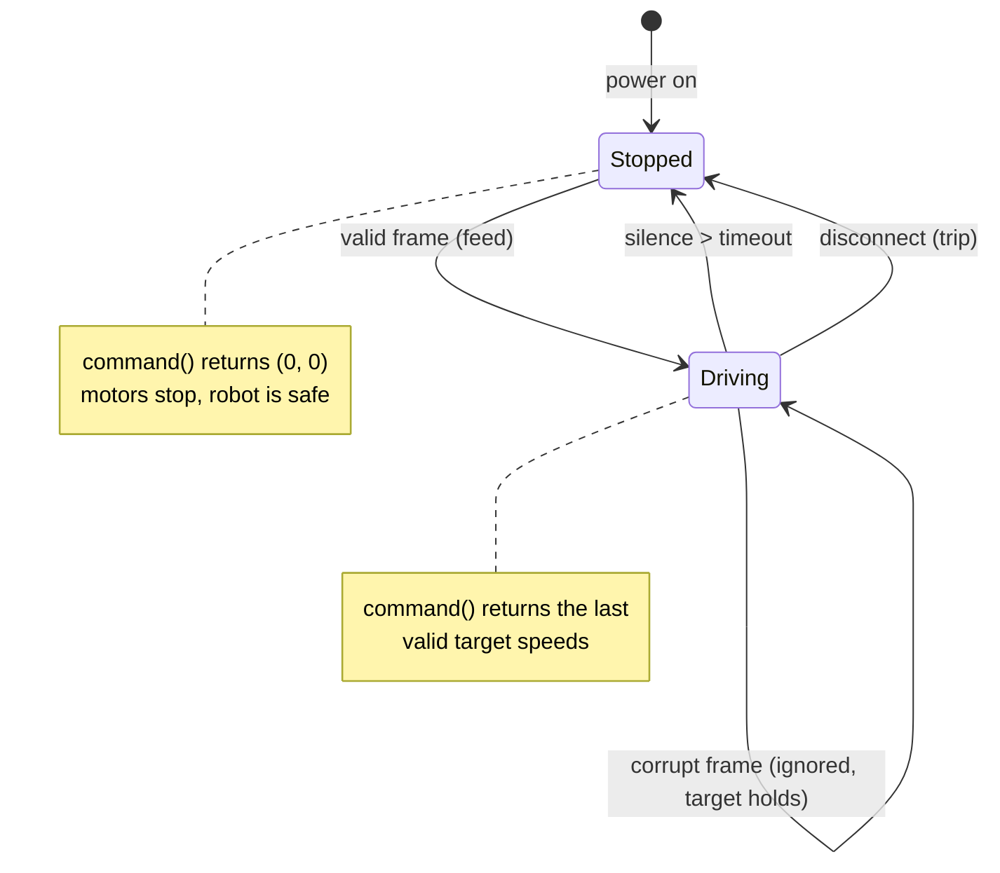

# comms/cmdvel-protocol

The drive-command protocol from the Hands-On-Robotics robot car: one UTF-8
text frame per command —

```
"<left>,<right>"          e.g. "250,-250"
```

speeds in signed per-mille (`-1000..=1000`, the same unit
`drivers/l298n` takes), plus the **watchdog** that made the reference robot
safe: if no valid frame arrives within the timeout (500 ms in the reference
firmware), the commanded speeds decay to zero. A dropped BLE link stops the
robot instead of letting it drive into a wall.

Transport-agnostic and `no_std` with zero dependencies: feed it bytes from
a BLE characteristic write, a UART, a UDP packet — anything.

## Protocol contract

| rule                      | behaviour                                        |
| ------------------------- | ------------------------------------------------ |
| valid frame               | becomes the target until the next frame          |
| corrupt frame             | ignored (previous target holds; watchdog still guards) |
| silence > timeout         | `command()` returns `(0, 0)`                     |
| explicit disconnect       | call `trip()` — zeros immediately, no wait       |



## Usage (firmware side)

```rust
mod comms { pub mod cmdvel; }                // module wiring in main.rs
use comms::cmdvel::{parse_frame, Watchdog};

let mut dog = Watchdog::new(500);
// in your radio-receive callback / uart read:
if let Ok(cmd) = parse_frame(rx_bytes) {
    dog.feed(cmd, now_ms);
}
// in your 50 Hz control loop:
let run = dog.command(now_ms);
motors.drive(run.left, run.right)?;          // drivers/l298n
```

The controller side (an app, a gamepad bridge) uses `encode_frame`.

BLE reference UUIDs (from the verified C++ firmware, if you want to stay
app-compatible): service `12345678-1234-5678-1234-56789abcdef0`, command
characteristic `…def1` (WRITE / WRITE_NR), device name `HOR-Car-BLE`.

## Try it (no hardware)

```bash
cargo run --example cmdvel_replay
```

Replays a command timeline with a corrupt frame and a link dropout so you
can watch the watchdog do its job.
