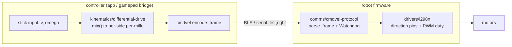

# drivers/l298n

L298N dual H-bridge DC motor driver, generic over `embedded-hal 1.0`:
`OutputPin` × 2 for direction, `SetDutyCycle` for speed, per motor channel.
Speeds are signed per-mille (`-1000..=1000`), clamped, `0` = coast.

Ported from the Hands-On-Robotics module 07 firmware (C++, verified on an
ESP32 DevKit v1 driving a 2WD chassis).

## Wiring (ESP32 DevKit reference)

| L298N pin | ESP32 pin | Role                       |
| --------- | --------- | -------------------------- |
| ENA       | GPIO22    | Right motor PWM (1 kHz)    |
| IN1       | GPIO16    | Right direction A          |
| IN2       | GPIO17    | Right direction B          |
| ENB       | GPIO23    | Left motor PWM (1 kHz)     |
| IN3       | GPIO18    | Left direction A           |
| IN4       | GPIO19    | Left direction B           |
| +12V      | battery + | Motor supply (5–12 V)      |
| GND       | GND       | **Must share MCU ground**  |

Remove the ENA/ENB jumpers on the breakout before wiring PWM to them.

## Usage

```rust
mod drivers { pub mod l298n; }               // module wiring in main.rs
use drivers::l298n::{L298n, Motor};

let mut motors = L298n::new(
    Motor::new(in3, in4, enb_pwm),           // left
    Motor::new(in1, in2, ena_pwm),           // right
);
motors.drive(600, 600)?;                     // ~60% forward
motors.drive(-400, 400)?;                    // spin in place
motors.stop()?;                              // coast both
```

Pair it with `kinematics/differential-drive` to convert `(v, ω)` commands
into these per-side speeds, and `comms/cmdvel-protocol` for the BLE/serial
command framing + safety watchdog. The full robot-car stack, every stage a
vendored component:



## Try it (no hardware)

```bash
cargo run --example l298n_sweep
```

## Troubleshooting

- **Motor hums but doesn't turn** — duty too low; most gear motors need
  ≳30% (300‰) to overcome stiction.
- **One side runs backwards** — swap that side's IN pins, or negate its speed.
- **MCU browns out when motors start** — motors on a separate supply, common
  ground; add a bulk capacitor across the motor rail.
