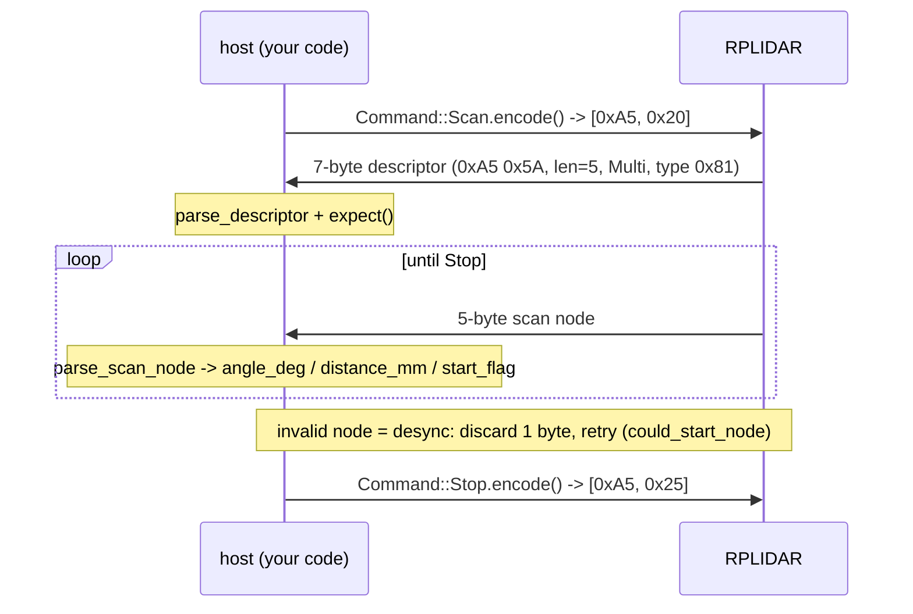

# sensors/rplidar

Pure-`no_std` parser for the SLAMTEC RPLIDAR wire protocol. **No I/O** — you
read bytes from a UART however your platform does it and feed them to these
functions; they hand back typed commands, descriptors and scan measurements.

Extracted from [olivaw-lidar](https://github.com/Project-Olivaw/olivaw-lidar),
whose `transport` and `device` layers show a complete serial driver built on
exactly this module.

## Wiring (ESP32 DevKit reference)

| RPLIDAR C1 pin | ESP32 pin | Notes                          |
| -------------- | --------- | ------------------------------ |
| VCC (5V)       | VIN / 5V  | Motor + core; needs real 5V    |
| GND            | GND       | Common ground                  |
| TX             | GPIO16    | UART2 RX, 460800 baud          |
| RX             | GPIO17    | UART2 TX                       |

A1/A2 models: 115200 baud, and the motor is enabled via the MOTOR_CTL pin
(PWM) rather than a protocol command.

## Protocol shape



## Usage sketch

```rust
mod sensors { pub mod rplidar; }        // module wiring in main.rs
use sensors::rplidar::{Command, MAX_REQUEST_LEN};
use sensors::rplidar::descriptor::{parse_descriptor, DESCRIPTOR_LEN};
use sensors::rplidar::scan_node::{parse_scan_node, SCAN_NODE_LEN};

// 1. send the SCAN request
let mut buf = [0u8; MAX_REQUEST_LEN];
let len = Command::Scan.encode(&mut buf);
uart.write_all(&buf[..len])?;

// 2. read the 7-byte descriptor, then 5-byte nodes forever
let mut head = [0u8; DESCRIPTOR_LEN];
uart.read_exact(&mut head)?;
parse_descriptor(&head)?;
loop {
    let mut node = [0u8; SCAN_NODE_LEN];
    uart.read_exact(&mut node)?;
    let m = parse_scan_node(&node)?;      // desync? drop 1 byte and retry
    // m.angle_deg(), m.distance_mm(), m.start_flag …
}
```

Units: angles in degrees (Q6 fixed-point on the wire), distances in
millimetres (Q2). `distance_q2 == 0` means "no return".

## Try it (no hardware)

```bash
cargo run --example rplidar_decode
```

## Troubleshooting

- **`BadSync` / `InvalidScanNode`** — the stream is desynchronized (usually a
  half-read left over from before a reset). Discard one byte and retry; the
  `could_start_node` helper makes resync cheap.
- **Garbage after `Reset`** — expected: the device prints an unframed ASCII
  boot banner. Flush the input before the next request.
- **No data at all** — C1 talks 460800 baud; A1 115200. Check TX/RX are
  crossed, and that the motor is actually spinning.
