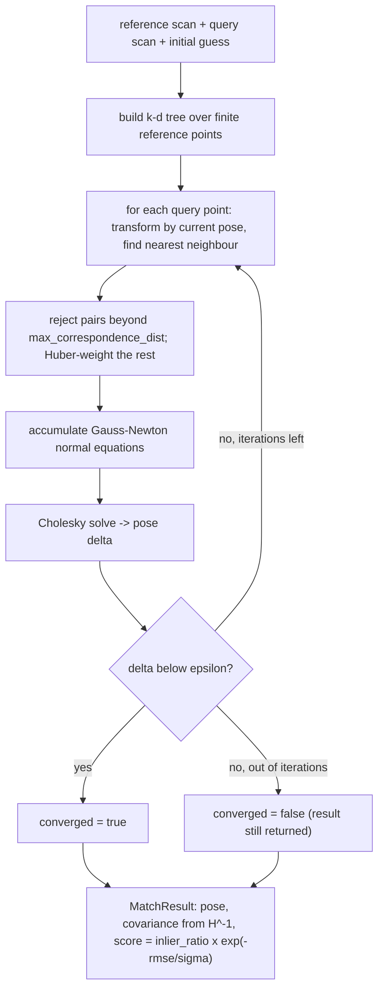

# slam/scan-matcher

Point-to-point ICP scan matching, extracted from
[olivaw-slam](https://github.com/Project-Olivaw/olivaw-slam): given two lidar
scans and an initial guess, recover the rigid transform between them — with
a covariance estimate and an honest `converged` flag instead of silent
garbage.

Implementation: k-d tree correspondences (kiddo), Huber-weighted
Gauss-Newton, inlier-ratio + RMSE scoring. Depends on `slam/core-types`
(installed automatically).



## When ICP is the right tool — and when it isn't

ICP is fast and precise **when the initial guess is good** (odometry, or
consecutive scans at a sane rate). With no guess at all it diverges silently
— check `result.converged` and `result.score`, they exist precisely for
that. If you have no odometry, you want a correlative matcher (bounded
search window, no guess needed): the full `olivaw-slam` crate provides one.

## Usage

```rust
mod slam {                                   // module wiring in main.rs
    pub mod error;
    pub mod matcher;
    pub mod pose;
    pub mod scan;
}
use slam::matcher::{IcpMatcher, IcpConfig, ScanMatcher};
use slam::pose::Pose2;

let matcher = IcpMatcher::default();          // or ::new(IcpConfig { … })
let result = matcher.match_scans(&previous_scan, &current_scan, &odom_guess)?;
if result.converged {
    pose = pose.compose(&result.pose);
}
```

Feed it `ScanCloud`s in metres (convert `sensors/rplidar`'s millimetres and
clockwise degrees at the boundary — once).

## Try it

```bash
cargo run --example scan_match_demo
```

Ray-casts two synthetic room scans with a known 12 cm + 4° offset and shows
ICP recovering it, with the covariance-derived uncertainty.
